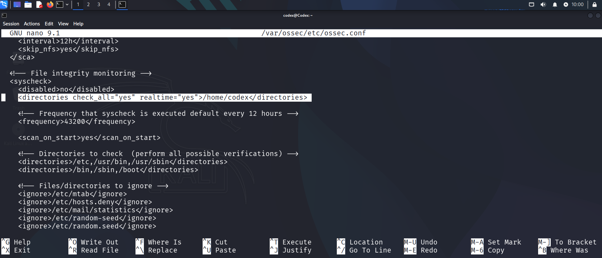
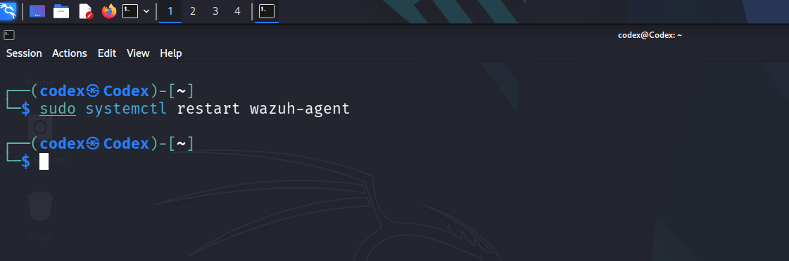
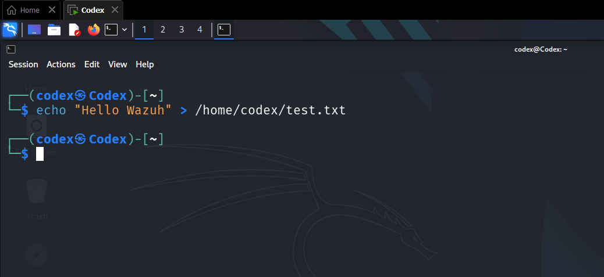
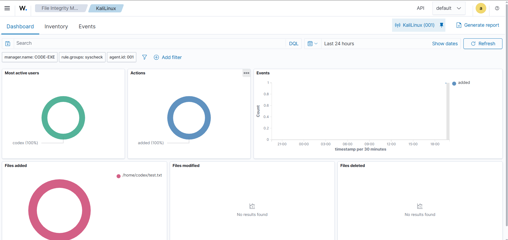

<div align="center">


# 🛡️ Wazuh File Integrity Monitoring (FIM)
### Hands-On Practical Lab — Real-Time File Change Detection

[](https://wazuh.com)
[](https://linux.org)
[](https://kali.org)
[](LICENSE)
[]()

> A complete hands-on cybersecurity lab demonstrating **real-time File Integrity Monitoring** using Wazuh — an open-source unified XDR and SIEM platform trusted by enterprises worldwide.

---

[📋 Overview](#-overview) • [🏗️ Architecture](#-lab-architecture) • [⚙️ Installation](#-part-1--wazuh-server-installation) • [🔧 Configuration](#-part-3--configuring-fim-on-the-agent) • [🧪 Testing](#-part-4--testing-fim) • [📊 Results](#-part-5--dashboard-results) • [💡 Takeaways](#-key-takeaways)

</div>

---

## 📌 Overview

This lab provides a complete walkthrough of implementing **Wazuh File Integrity Monitoring (FIM)** in a real environment — from zero to a fully functional security monitoring setup.

**What you will accomplish:**

| Step | Task | Outcome |
|------|------|---------|
| 1️⃣ | Install Wazuh Server (Manager + Dashboard + Indexer) | Centralized SIEM running |
| 2️⃣ | Deploy Wazuh Agent on Kali Linux endpoint | Endpoint connected to server |
| 3️⃣ | Configure real-time FIM using syscheck | Directory actively monitored |
| 4️⃣ | Trigger a file change event | Alert generated in real-time |
| 5️⃣ | Analyze the alert on Wazuh Dashboard | Full visibility achieved |

**Tech Stack:**

| Tool | Role | Version |
|------|------|---------|
| **Wazuh Manager** | Central event processor & rule engine | 4.x |
| **Wazuh Indexer** | Stores and indexes security events (OpenSearch) | 4.x |
| **Wazuh Dashboard** | Web UI for visualization and alerting | 4.x |
| **Wazuh Agent** | Lightweight endpoint monitor (syscheck/FIM) | 4.x |
| **Kali Linux** | Monitored endpoint machine | 2024.x |

---

## 🔍 What is File Integrity Monitoring?

**File Integrity Monitoring (FIM)** is a critical security control that continuously monitors files and directories for unauthorized changes. It is a foundational component of modern threat detection and compliance programs.

### How FIM Works

```
┌─────────────────────────────────────────────────────────┐
│                    FIM WORKFLOW                          │
│                                                         │
│  1. BASELINE      →   Takes cryptographic hash         │
│     (SHA256/MD5)      snapshot of monitored files      │
│                                                         │
│  2. MONITOR       →   Watches for inotify events       │
│     (Real-time)       (create / modify / delete)       │
│                                                         │
│  3. COMPARE       →   New hash ≠ Baseline hash?        │
│     (Integrity)       → Change detected!               │
│                                                         │
│  4. ALERT         →   Event sent to Wazuh Manager      │
│     (Notify)          → Dashboard alert generated      │
└─────────────────────────────────────────────────────────┘
```

### What FIM Detects

| Event Type | Description | Security Relevance |
|-----------|-------------|-------------------|
| 📁 **File Added** | New file created in monitored dir | Malware drop, unauthorized file |
| ✏️ **File Modified** | Existing file content changed | Config tampering, rootkit |
| 🗑️ **File Deleted** | File removed from monitored dir | Log deletion, evidence wiping |
| 🔐 **Permission Changed** | File permissions (chmod) modified | Privilege escalation attempt |
| 👤 **Owner Changed** | File ownership (chown) modified | Unauthorized access attempt |

### Compliance Frameworks That Require FIM

```
PCI-DSS  → Requirement 11.5 — Deploy file integrity monitoring
HIPAA    → §164.312(c)(1) — Integrity controls for ePHI
SOX      → Section 404 — Internal controls over financial reporting
GDPR     → Article 32 — Technical security measures
ISO 27001 → A.12.4.3 — Administrator and operator logs
```

---

## 🏗️ Lab Architecture

```
╔══════════════════════════════╗              ╔══════════════════════════════╗
║       WAZUH SERVER           ║              ║      KALI LINUX (AGENT)      ║
║   (Ubuntu / All-in-One)      ║              ║                              ║
║                              ║   TCP 1514   ║  ┌─────────────────────┐    ║
║  ┌────────────────────────┐  ║◄────────────►║  │   Wazuh Agent       │    ║
║  │  Wazuh Manager         │  ║  (Agent-Mgr) ║  │   (wazuh-agent)     │    ║
║  │  • Rule processing     │  ║              ║  └─────────────────────┘    ║
║  │  • Alert generation    │  ║              ║            │                 ║
║  └────────────────────────┘  ║              ║            ▼                 ║
║  ┌────────────────────────┐  ║              ║  ┌─────────────────────┐    ║
║  │  Wazuh Indexer         │  ║              ║  │   Syscheck (FIM)    │    ║
║  │  (OpenSearch)          │  ║              ║  │   realtime="yes"    │    ║
║  │  • Event storage       │  ║              ║  └─────────────────────┘    ║
║  └────────────────────────┘  ║              ║            │                 ║
║  ┌────────────────────────┐  ║              ║            ▼                 ║
║  │  Wazuh Dashboard       │  ║              ║  ┌─────────────────────┐    ║
║  │  (Web UI — HTTPS)      │  ║              ║  │  Monitored Dir:     │    ║
║  │  • FIM visualization   │  ║              ║  │  /home/codex        │    ║
║  └────────────────────────┘  ║              ║  └─────────────────────┘    ║
╚══════════════════════════════╝              ╚══════════════════════════════╝

Port 443 (HTTPS) ──► Dashboard Access (Browser)
Port 1514 (TCP)  ──► Agent ↔ Manager Communication
Port 1515 (TCP)  ──► Agent Registration
```

### Network Requirements

| Port | Protocol | Direction | Purpose |
|------|----------|-----------|---------|
| `443` | HTTPS | Browser → Server | Dashboard access |
| `1514` | TCP | Agent → Manager | Event forwarding |
| `1515` | TCP | Agent → Manager | Agent registration |
| `9200` | TCP | Internal | Indexer API |

---

## 🖥️ Prerequisites

### Wazuh Server (Manager Machine)
- **OS:** Ubuntu 20.04 / 22.04 LTS (recommended)
- **RAM:** Minimum 4 GB (8 GB recommended)
- **CPU:** 2 cores minimum
- **Disk:** 50 GB free space
- **Network:** Static IP, reachable from agent machine

### Wazuh Agent Machine (Kali Linux)
- **OS:** Kali Linux 2023.x or newer
- **RAM:** 1 GB minimum
- **Network:** Can reach Wazuh Server on ports 1514/1515

### General Requirements
- Root or sudo access on both machines
- Internet connectivity (for package downloads)
- Both machines on the same network (or routable)

---

## ⚙️ Part 1 — Wazuh Server Installation

### Step 1: Download the Installation Script

Wazuh provides an all-in-one installer that sets up **Manager + Indexer + Dashboard** automatically.

```bash
# Download the Wazuh installation assistant
curl -sO https://packages.wazuh.com/4.11/wazuh-install.sh

# Verify the download (optional but recommended)
ls -lh wazuh-install.sh
```

### Step 2: Run the All-in-One Installation

```bash
# Execute the installer with -a flag (all components)
sudo bash wazuh-install.sh -a
```

> ⏱️ **Estimated Time:** 10–20 minutes depending on hardware and internet speed.

**What this installs:**

```
wazuh-install.sh -a
    ├── Wazuh Indexer    (OpenSearch — stores events)
    ├── Wazuh Manager    (processes rules, generates alerts)
    └── Wazuh Dashboard  (web UI for visualization)
```

### Step 3: Retrieve Dashboard Credentials

After installation completes, credentials are displayed. **Note them immediately.**

```bash
# If you missed the credentials, extract them with:
sudo tar -O -xvf wazuh-install-files.tar wazuh-install-files/wazuh-passwords.txt
```

**Expected output:**
```
The Wazuh web interface is available at:
    URL: https://<YOUR_SERVER_IP>
    User: admin
    Password: <auto-generated-secure-password>
```

### Step 4: Access the Wazuh Dashboard

Open your browser and navigate to:
```
https://<WAZUH_SERVER_IP>
```

> ⚠️ **SSL Warning:** You may see a self-signed certificate warning — this is expected. Click "Advanced" → "Proceed" to continue.

Log in with the credentials from Step 3. You should see the Wazuh Dashboard home screen.

---

## 🤖 Part 2 — Wazuh Agent Installation (Kali Linux)

### Step 1: Import the Wazuh GPG Key

```bash
curl -s https://packages.wazuh.com/key/GPG-KEY-WAZUH | \
  gpg --no-default-keyring \
  --keyring gnupg-ring:/usr/share/keyrings/wazuh.gpg \
  --import && \
  chmod 644 /usr/share/keyrings/wazuh.gpg
```

### Step 2: Add the Wazuh Repository

```bash
echo "deb [signed-by=/usr/share/keyrings/wazuh.gpg] \
  https://packages.wazuh.com/4.x/apt/ stable main" | \
  sudo tee -a /etc/apt/sources.list.d/wazuh.list

# Update package list
sudo apt-get update
```

### Step 3: Install the Agent

> 📝 Replace `<YOUR_WAZUH_SERVER_IP>` with your actual Wazuh Manager IP.

```bash
WAZUH_MANAGER="<YOUR_WAZUH_SERVER_IP>" \
  sudo apt-get install -y wazuh-agent
```

### Step 4: Enable and Start the Agent

```bash
# Reload systemd daemon
sudo systemctl daemon-reload

# Enable agent to start on boot
sudo systemctl enable wazuh-agent

# Start the agent service
sudo systemctl start wazuh-agent
```

### Step 5: Verify Connection

**On the agent (Kali Linux):**
```bash
sudo systemctl status wazuh-agent
```

Expected output:
```
● wazuh-agent.service - Wazuh agent
     Loaded: loaded (/lib/systemd/system/wazuh-agent.service)
     Active: active (running) since ...
```

**On the Wazuh Dashboard:**

Navigate to → **Agents** section. Your Kali Linux agent should appear as **🟢 Active**.

---

## 🔧 Part 3 — Configuring FIM on the Agent

### Step 1: Open the Agent Configuration File

```bash
sudo nano /var/ossec/etc/ossec.conf
```

### Step 2: Configure the Syscheck (FIM) Block

> 📸 **Screenshot — ossec.conf syscheck configuration:**



Locate the `<syscheck>` section and update it as follows:

```xml
<!-- ═══════════════════════════════════════════════════ -->
<!--          FILE INTEGRITY MONITORING (FIM)           -->
<!-- ═══════════════════════════════════════════════════ -->
<syscheck>

    <!-- Enable FIM -->
    <disabled>no</disabled>

    <!-- Scan at agent startup -->
    <scan_on_start>yes</scan_on_start>

    <!-- Full scan frequency: every 12 hours (43200 seconds) -->
    <frequency>43200</frequency>

    <!-- ─── Custom monitored directory (REAL-TIME) ─── -->
    <directories check_all="yes" realtime="yes">/home/codex</directories>

    <!-- ─── Standard system directories ─── -->
    <directories check_all="yes">/etc,/usr/bin,/usr/sbin</directories>
    <directories check_all="yes">/bin,/sbin,/boot</directories>

    <!-- ─── Exclusions (noisy / frequently changing files) ─── -->
    <ignore>/etc/mtab</ignore>
    <ignore>/etc/hosts.deny</ignore>
    <ignore>/etc/mail/statistics</ignore>
    <ignore>/etc/random-seed</ignore>
    <ignore>/etc/random.seed</ignore>
    <ignore>/etc/adjtime</ignore>
    <ignore>/etc/resolv.conf</ignore>

</syscheck>
```

### Configuration Reference

| Parameter | Value | What It Does |
|-----------|-------|--------------|
| `disabled` | `no` | Activates FIM module |
| `scan_on_start` | `yes` | Runs a full baseline scan when agent starts |
| `frequency` | `43200` | Full scheduled scan every 12 hours |
| `check_all` | `yes` | Verifies size, hash (MD5/SHA1/SHA256), permissions, owner, group, timestamps |
| `realtime` | `yes` | Uses Linux **inotify** for instant change detection |

> 💡 **Why `realtime="yes"` matters:** Without it, changes are only detected on the next scheduled scan (up to 12 hours later). With real-time enabled, alerts fire **within seconds** of a change.

### Step 3: Restart the Agent to Apply Changes

```bash
sudo systemctl restart wazuh-agent

# Confirm it's running
sudo systemctl status wazuh-agent
```

> 📸 **Screenshot — Wazuh agent successfully restarted:**



---

## 🧪 Part 4 — Testing FIM

Now we trigger a FIM alert by creating a file inside the monitored directory.

### Create a Test File

```bash
echo "Hello Wazuh — FIM Test" > /home/codex/test.txt
```

> 📸 **Screenshot — Creating the test file that triggers the FIM alert:**



### What Happens Internally

```
User creates /home/codex/test.txt
        │
        ▼
Linux inotify kernel event fires (IN_CREATE)
        │
        ▼
Wazuh Agent syscheck detects the event
        │
        ▼
Agent computes SHA256 hash of new file
        │
        ▼
Event forwarded to Wazuh Manager (TCP 1514)
        │
        ▼
Manager matches rule: "File added to monitored directory"
        │
        ▼
Alert generated → Indexed in Wazuh Indexer
        │
        ▼
Alert visible on Wazuh Dashboard ✅
```

### Additional Test Scenarios

```bash
# Test 1 — File Added (already done above)
echo "Hello Wazuh" > /home/codex/test.txt

# Test 2 — File Modified
echo "Modified content" >> /home/codex/test.txt

# Test 3 — Permission Changed
chmod 777 /home/codex/test.txt

# Test 4 — File Deleted
rm /home/codex/test.txt
```

Each action above will generate a **separate FIM alert** on the dashboard.

---

## 📊 Part 5 — Dashboard Results

> 📸 **Screenshot — Wazuh Dashboard FIM results showing the detected file event:**



### Navigate to the FIM Module

```
Wazuh Dashboard
    └── Modules
        └── File Integrity Monitoring
            └── Select Agent: KaliLinux (001)
```

### Apply Filters

```
manager.name   : CODE-EXE
rule.groups    : syscheck
agent.id       : 001
```

### Alert Summary

| Dashboard Panel | Result Observed |
|----------------|----------------|
| **Most Active Users** | `codex (100%)` |
| **Event Action** | `added (100%)` |
| **Events Timeline** | Single spike at time of file creation |
| **Files Added** | `/home/codex/test.txt` ✅ |
| **Files Modified** | — (not triggered) |
| **Files Deleted** | — (not triggered) |
| **Rule ID Triggered** | `554` — File added to the system |
| **Alert Level** | `5` (Informational → Audit) |

### FIM Alert Details (JSON)

```json
{
  "agent": {
    "id": "001",
    "name": "KaliLinux"
  },
  "rule": {
    "id": "554",
    "description": "File added to the system.",
    "level": 5,
    "groups": ["syscheck", "syscheck_entry_added"]
  },
  "syscheck": {
    "path": "/home/codex/test.txt",
    "event": "added",
    "sha256_after": "<hash>",
    "uid_after": "1000",
    "uname_after": "codex",
    "mode": "realtime"
  }
}
```

---

## 💡 Key Takeaways

### What We Learned

```
✅  Wazuh FIM uses the syscheck module with inotify for real-time detection

✅  realtime="yes" enables instant (sub-second) alert generation

✅  check_all="yes" verifies: size, MD5, SHA1, SHA256,
    permissions, owner, group, and timestamps

✅  FIM detects: File Added / Modified / Deleted /
    Permission Changed / Owner Changed

✅  The Wazuh Dashboard provides clear visual breakdown:
    user attribution, action type, event timeline

✅  FIM is required for PCI-DSS, HIPAA, SOX, GDPR compliance
```

### Real-World Attack Scenarios FIM Can Catch

| Attack | What FIM Detects |
|--------|-----------------|
| **Malware drop** | New executable added to `/tmp` or `/home` |
| **Rootkit installation** | System binary in `/bin` or `/sbin` modified |
| **Log tampering** | Log file in `/var/log` deleted or modified |
| **Config backdoor** | `/etc/ssh/sshd_config` or `/etc/sudoers` changed |
| **Web shell upload** | New `.php` file added to web root |
| **Privilege escalation** | Permissions on sensitive file changed to 777 |

---

## 📚 References

| Resource | Link |
|----------|------|
| Wazuh FIM Documentation | [documentation.wazuh.com — FIM](https://documentation.wazuh.com/current/user-manual/capabilities/file-integrity/index.html) |
| Wazuh Installation Guide | [documentation.wazuh.com — Install](https://documentation.wazuh.com/current/installation-guide/index.html) |
| Syscheck Configuration Reference | [documentation.wazuh.com — Syscheck](https://documentation.wazuh.com/current/user-manual/reference/ossec-conf/syscheck.html) |
| Wazuh Agent Deployment | [documentation.wazuh.com — Agent](https://documentation.wazuh.com/current/installation-guide/wazuh-agent/index.html) |
| PCI-DSS Requirement 11.5 | [pcisecuritystandards.org](https://www.pcisecuritystandards.org) |
| Linux inotify Documentation | [man7.org/inotify](https://man7.org/linux/man-pages/man7/inotify.7.html) |

---

## 📁 Repository Structure

```
wazuh-fim-lab/
├── README.md                    ← This file
├── LICENSE                      ← MIT License
├── config/
│   └── ossec.conf               ← Sample syscheck configuration
└── screenshots/
    ├── 01-ossec-conf-syscheck.png
    ├── 02-restart-wazuh-agent.png
    ├── 03-create-test-file.png
    └── 04-fim-dashboard.png
```

---

<div align="center">

---

**⭐ If this lab helped you, consider starring the repository!**

Made with 🔐 by **Codex** | Cybersecurity Practical Labs

[](https://github.com/prasadkakad)

</div>
